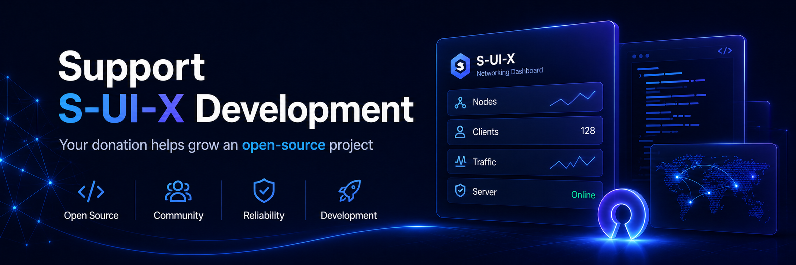

## S-UI-X Extended

[English](README.md) | [Русский](README-RU.md)

<p align="center">
  
</p>
<p align="center">
  <a href="https://github.com/deposist/s-ui-x-extended/releases/latest">
    
  </a>
  <a href="https://github.com/deposist/s-ui-x-extended/releases">
    
  </a>
  <a href="https://github.com/deposist/s-ui-x-extended/blob/main/LICENSE">
    
  </a>
  <a href="https://github.com/deposist/s-ui-x-extended/stargazers">
    
  </a>
</p>

<p align="center">
  
</p>

<p align="center">
  
</p>

## Support S-UI-X Extended

S-UI-X Extended is an open-source project. Donations help pay for development, security work, testing, and release preparation.

- WEB: [https://web.tribute.tg/d/LRJ](https://web.tribute.tg/d/LRJ)
- Telegram: [https://t.me/tribute/app?startapp=dLRJ](https://t.me/tribute/app?startapp=dLRJ)

| Network | Address |
| ------- | ------- |
| TON | `UQB5-DZ3q5vjXGf3_tVUeOHPNuXMLh8lfY0MPW3uGzjdOzke` |
| ETH | `0x0e67e1b4363a163c36943Ef4F9227c3126bB952B` |
| SOL | `BtFm5E1BrUjpoaDNwv3emc2qbyvqkn6ECnDzwhgRn7Df` |
| TRX | `TFqEbp1Z82ZQebzDdsW1MbytMvVsHJGpPd` |
| BTC | `bc1qn86mfmsnackfwvjd4czjaalv75sh830fws7xc9` |

S-UI-X Extended is a web panel built on [`sing-box-extended`](https://github.com/shtorm-7/sing-box-extended), the shtorm-7 fork of `SagerNet/sing-box`.

This repository is based on `alireza0/s-ui` from `v1.4.1`. It keeps parity with upstream s-ui-x `v1.5.10-beta7` and runs on the `sing-box-extended` core.

You can use the published install scripts, or fork the repository and build it yourself.

> Disclaimer: this project is intended only for personal learning and knowledge sharing. Do not use it for illegal purposes.

## Releases

Configuration and usage guides:

- English guide: [`docs/INSTRUCTIONS-EN.md`](docs/INSTRUCTIONS-EN.md)
- Russian guide: [`docs/INSTRUCTIONS-RU.md`](docs/INSTRUCTIONS-RU.md)

Release history and upgrade notes:

- English changelog: [`CHANGELOG-EN.md`](CHANGELOG-EN.md)
- Russian changelog: [`CHANGELOG-RU.md`](CHANGELOG-RU.md)
- Simplified Chinese changelog: [`CHANGELOG-ZH.md`](CHANGELOG-ZH.md)
- Latest stable notes: [`docs/releases/v1.0.0.md`](docs/releases/v1.0.0.md)
- Latest pre-release notes: [`.github/RELEASE_NOTES_v1.0.1-beta1.md`](.github/RELEASE_NOTES_v1.0.1-beta1.md)
- Upstream parity reference: [`docs/releases/v1.5.10-beta7.md`](docs/releases/v1.5.10-beta7.md)

## How this differs from `alireza0/s-ui`

<details>
  <summary>Show details</summary>

This fork is built to stay compatible with existing 1.x installs. You can replace the binary on an existing server, and the panel runs database migrations on first start. Protocol behavior stays close to upstream; most changes are in security, operations, observability, release handling, and the admin UI.

- Fresh installs create a random first admin password. Passwords use bcrypt, browser sessions use hardened cookies, mutating browser API calls require CSRF protection, and API tokens are hashed with `admin`, `read`, `write`, or `observability` scopes.
- Telegram credentials, proxy credentials, install salt, and other sensitive settings are encrypted at rest with secretbox. Telegram messages, audit details, backup captions, and change history are redacted before they leave the panel.
- Network-facing inputs have stricter checks. `X-Forwarded-For` is ignored unless trusted proxies are configured. External subscription fetches validate URLs and resolved IPs, block private and loopback targets by default, cap responses at 4 MiB, and re-check IPs at dial time.
- Subscriptions support per-client secrets for link, JSON, and Clash formats. Legacy name-based subscription URLs still work while `subSecretRequired=false`. Subscription responses sanitize headers, apply per-IP rate limits, support gzip, and cache successful output briefly.
- sing-box runs as an embedded Go library rather than a subprocess. Saves for clients, TLS, inbounds, outbounds, endpoints, and services hot-apply the affected object where possible. A full restart is used only when a change requires it or hot apply cannot keep the running config safe.
- Routing includes panel-managed outbound groups and provider-backed membership. Selector, URLTest, fallback, and failover groups include tag validation, previews, and capability metadata. The panel-managed `failover` type checks members over HTTPS, moves new connections away from a failed active member, and supports explicit all-down policies.
- The panel can update itself from Settings. Admins can check stable or beta releases, verify the downloaded binary against the release SHA-256, apply the update, and roll back automatically if the new binary repeatedly fails to start. The action is audited and requires password re-entry.
- Backup and import flows are more defensive. Imports enforce a 64 MiB cap, SQLite magic checks, staging, read-only integrity checks, schema migrations, and rollback to the previous database on failure. Local unencrypted database export streams the prepared SQLite file instead of buffering the whole backup in memory.
- Audit and observability are built in. The panel stores audit events with retention cleanup, exposes a scoped and paginated audit API, keeps bounded logs, samples bounded observability buckets, and publishes realtime events through a hardened WebSocket path with single-use tokens and Origin checks.
- Client IP history uses salted hashes by default. Raw IP display is opt-in, retention is configurable, and enforce mode rejects only new over-limit connections instead of closing active ones.
- Panel and subscription HTTP servers use read, write, header, and idle timeouts. TLS uses `MinVersion = 1.2`. Security headers are enabled, and subscription responses are marked no-store. If a saved listen IP no longer exists on the host, fallback stays restricted instead of silently widening exposure.
- Nexus is the main panel interface. Shared pages still reuse existing components where practical, settings show defaults and help text, update release notes render as safe Markdown, and route-based code splitting keeps heavy views out of the initial page load.
- Performance work covers daily operations: optimized stats queries and chart downsampling, batched stats writes, less duplicated settings reads in `/api/load`, parallel reads for independent load data, one marshal per WebSocket broadcast, and split frontend vendor chunks for browser caching.
- The panel, install script, and terminal menu include English, Russian, and Chinese localization.

</details>

## Supported Protocols

<details>
  <summary>Show supported protocols</summary>

This list follows the repository capability matrix. Some protocols, endpoints, and services require builds with the matching core tags.

### Inbound protocols

| Protocol | Notes |
| :--- | :--- |
| Socks | |
| HTTP | |
| Mixed | Socks + HTTP on one port |
| Shadowsocks | AEAD ciphers, 2022 methods |
| VMess | UUID auth, xudp/gRPC/WS |
| VLESS | Reality / TLS transport |
| Trojan | HTTPS camouflage, fallback |
| Naive | Chromium network stack |
| Hysteria | QUIC transport |
| Hysteria2 | QUIC transport |
| TUIC | QUIC transport |
| AnyTLS | |
| ShadowTLS | Detour to hidden protocol |
| Mieru | Stealth protocol |
| Sudoku | HTTP mask obfuscation |
| TrustTunnel | QUIC tunnel |
| SSH | SSH server emulation |
| MTProxy | Telegram proxy, FakeTLS, delivered as `tg://proxy` |
| Direct | Port forward / relay |
| Tun | Virtual network interface |
| Redirect | Linux redirect transparent proxy |
| TProxy | Linux transparent proxy |
| Bond | Native core aggregate inbound |
| Core failover | Native core failover inbound |

### Outbound protocols

| Protocol | Notes |
| :--- | :--- |
| Direct | Raw traffic, no proxy |
| Block | Silently drop traffic |
| Socks | |
| HTTP | |
| Shadowsocks | |
| VMess | |
| VLESS | |
| Trojan | |
| Naive | |
| Tor | SOCKS5 to Tor daemon |
| SSH | |
| ShadowTLS | |
| AnyTLS | |
| Mieru | |
| TrustTunnel | |
| Sudoku | |
| MASQUE | |
| OpenVPN | |
| Hysteria | |
| Hysteria2 | |
| TUIC | |
| Core failover | Native core dial-time failover |

### Outbound groups

| Type | Managed by | Notes |
| :--- | :--- | :--- |
| Selector | Core | Manual switch, operator picks member |
| URLTest | Core | Auto-select lowest-latency member |
| Fallback | Core | Connect-time failover |
| Failover | Panel | Periodic health checks and all-down policies; affects new connections |

### Providers

| Type | Notes |
| :--- | :--- |
| Inline | Hand-written members in panel |
| Local | Local file provider |
| Remote | Remote subscription provider |

### Endpoints

| Type | Notes |
| :--- | :--- |
| WireGuard | Requires WireGuard-enabled core build |
| Tailscale | Requires Tailscale-enabled core build |
| VPN | WARP/VPN client and server endpoint |

### Core services

| Service | Notes |
| :--- | :--- |
| resolved | DNS resolver service |
| ssm-api | SSM API service |
| derp | DERP service |
| ccm | Requires CCM-enabled core build |
| ocm | Requires OCM-enabled core build |
| oom-killer | Requires oom-killer-enabled core build |
| profiler | Development profiling service |

</details>

## Supported Platforms

| Platform | Architecture | Status |
|----------|--------------|---------|
| Linux | amd64, arm64, armv7, armv6, armv5, 386, s390x | Supported |
| Windows | amd64, 386, arm64 | Supported |
| macOS | amd64, arm64 | Experimental support |

## Default Installation Information

- Panel port: 2095
- Panel path: /app/
- Subscription port: 2096
- Subscription path: /sub/
- Subscription per-IP rate-limit changes (`subRateLimitPerIP`) take effect within 1 minute after saving.
- Username: admin
- Password for a fresh install: a random 24-character string is generated on first start and written to the application log. Look for `created initial admin user. username=admin password=...` in `journalctl -u s-ui` on Linux or in the panel log on first run. Change it from the panel after you sign in.

## Install or upgrade

Use the stable build for normal installations. Use beta releases only if you want to test changes before they become stable.

| Channel | Version | Notes |
|---|---|---|
| Stable | `v1.0.0` | First stable release. Includes the extended protocol panel, panel-managed groups, failover health, full option coverage checks, and release artifacts built with the supported protocol tags. Release notes: [`docs/releases/v1.0.0.md`](docs/releases/v1.0.0.md). |
| Beta | `v1.0.1-beta1` | Latest pushed beta release. Use it for pre-release testing. Release notes: [`.github/RELEASE_NOTES_v1.0.1-beta1.md`](.github/RELEASE_NOTES_v1.0.1-beta1.md). |

### Linux/macOS, stable

```sh
bash <(curl -Ls https://raw.githubusercontent.com/deposist/s-ui-x-extended/v1.0.0/install.sh)
```

The command above installs the latest stable release. Pass a version tag explicitly if you need a specific beta or older build.

### Local clone

```sh
git clone --branch v1.0.0 --depth 1 https://github.com/deposist/s-ui-x-extended.git
cd s-ui-x-extended
sudo bash install.sh v1.0.0
```

### Windows

- Stable: download `v1.0.0` from [its release page](https://github.com/deposist/s-ui-x-extended/releases/tag/v1.0.0), extract the ZIP, and run `install-windows.bat` as Administrator.
- Beta: `v1.0.1-beta1` is available on [its release page](https://github.com/deposist/s-ui-x-extended/releases/tag/v1.0.1-beta1).

Existing installations keep their settings, users, inbounds, outbounds, clients, TLS, services, and tokens. Database migrations run automatically on first start. Upgrade and rollback notes are in the changelog files: [EN](CHANGELOG-EN.md), [RU](CHANGELOG-RU.md), [中文](CHANGELOG-ZH.md).

## Manual Installation

<details>
  <summary>Show manual installation steps</summary>

### Linux/macOS

1. Download the latest S-UI-X Extended version for your system and architecture from GitHub: [https://github.com/deposist/s-ui-x-extended/releases/latest](https://github.com/deposist/s-ui-x-extended/releases/latest)
2. Optional: download the latest `s-ui.sh`: [https://raw.githubusercontent.com/deposist/s-ui-x-extended/v1.0.0/s-ui.sh](https://raw.githubusercontent.com/deposist/s-ui-x-extended/v1.0.0/s-ui.sh)
3. Optional: copy `s-ui.sh` to `/usr/bin/` and run `chmod +x /usr/bin/s-ui`.
4. Extract the S-UI-X Extended tar.gz archive to your chosen directory and enter the extracted folder.
5. Copy the `*.service` files to `/etc/systemd/system/`, then run `systemctl daemon-reload`.
6. Run `systemctl enable s-ui --now` to enable autostart and start the `s-ui` service used by S-UI-X Extended.
7. Run `systemctl enable sing-box --now` to start the sing-box service.

### Windows

1. Download the latest Windows version from GitHub: [https://github.com/deposist/s-ui-x-extended/releases/latest](https://github.com/deposist/s-ui-x-extended/releases/latest)
2. Download the appropriate Windows package, for example `s-ui-windows-amd64.zip`.
3. Extract the ZIP file to your chosen directory.
4. Run `install-windows.bat` as Administrator.
5. Follow the installation wizard.
6. Open the panel: http://localhost:2095/app

</details>

## Uninstall S-UI-X Extended

```sh
sudo -i

systemctl disable s-ui  --now

rm -f /etc/systemd/system/sing-box.service
systemctl daemon-reload

rm -fr /usr/local/s-ui
rm /usr/bin/s-ui
```

## Docker Installation

<details>
   <summary>Show details</summary>

### Usage

Step 1: install Docker

```shell
curl -fsSL https://get.docker.com | sh
```

Step 2: install S-UI-X Extended

Docker Compose option:

```shell
services:
  s-ui:
    image: ghcr.io/deposist/s-ui-x-extended
    container_name: s-ui-x-extended
    hostname: "s-ui-x-extended"
    network_mode: host
    volumes:
      - "./db:/app/db"
      - "./cert:/app/cert"
    tty: true
    restart: unless-stopped
    entrypoint: "./entrypoint.sh"
```

`docker compose up -d`

Direct Docker run:

```shell
mkdir s-ui-x-extended && cd s-ui-x-extended

docker run -itd \
    --network host \
    -v $PWD/db/:/app/db/ \
    -v $PWD/cert/:/root/cert/ \
    --name s-ui-x-extended \
    --restart=unless-stopped \
    ghcr.io/deposist/s-ui-x-extended
```

Build the image yourself:

```shell
git clone https://github.com/deposist/s-ui-x-extended
docker build -t s-ui-x-extended .
```

</details>

## Manual Run for Development and Contributions

<details>
   <summary>Show details</summary>

### Build and Run the Full Project

```shell
./runSUI.sh
```

### Clone the Repository

```shell
git clone https://github.com/deposist/s-ui-x-extended
```

### Frontend

The frontend code is in the [frontend](frontend) directory.

### Backend

Build the frontend at least once before building the backend.

Build the backend:

```shell
rm -fr web/html/*
cp -R frontend/dist/ web/html/
go build -o sui main.go
```

Run the backend from the repository root:

```shell
./sui
```

</details>

## Languages

- English
- Persian
- Vietnamese
- Simplified Chinese
- Traditional Chinese
- Russian

## Environment Variables

<details>
  <summary>Show details</summary>

### Usage

| Variable | Type | Default |
| -------------- | :--------------------------------------------: | :------------ |
| SUI_LOG_LEVEL | `"debug"` \| `"info"` \| `"warn"` \| `"error"` | `"info"` |
| SUI_DEBUG | `boolean` | `false` |
| SUI_BIN_FOLDER | `string` | `"bin"` |
| SUI_DB_FOLDER | `string` | `"db"` |
| SINGBOX_API | `string` | - |
| SUI_TRUSTED_PROXIES | comma-separated CIDRs or IPs | none, XFF ignored |
| SUI_ALLOW_PRIVATE_SUB_URLS | `boolean` | `false` |
| SUI_SECRETBOX_KEY | `string` | none, falls back to `settings.secret` |

For systemd installs run by `install.sh`, S-UI-X Extended generates a stable `SUI_SECRETBOX_KEY` once in `/etc/s-ui/secretbox.env`, shows the generated value once, and loads the file through a systemd drop-in. Keep that file private and preserve the same key across updates and restores.

</details>

## SSL Certificates

<details>
  <summary>Show details</summary>

### Certbot

```bash
snap install core; snap refresh core
snap install --classic certbot
ln -s /snap/bin/certbot /usr/bin/certbot

certbot certonly --standalone --register-unsafely-without-email --non-interactive --agree-tos -d <your domain>
```

</details>

#### Credits

- Original panel project: [alireza0/s-ui](https://github.com/alireza0/s-ui)
- Extended core: [shtorm-7/sing-box-extended](https://github.com/shtorm-7/sing-box-extended)

<picture>
  <source media="(prefers-color-scheme: dark)" srcset="https://api.star-history.com/chart?repos=deposist/s-ui-x-extended&type=date&theme=dark" />
  <source media="(prefers-color-scheme: light)" srcset="https://api.star-history.com/chart?repos=deposist/s-ui-x-extended&type=date" />
  
</picture>
